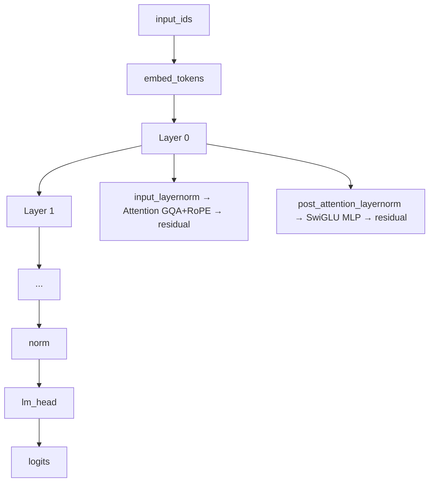

# 03 模型架构：Decoder-only Transformer

## 1. 总览



默认 64M 配置（`configs/model.yaml`）：`d_model=768, n_layers=8, q_heads=8, kv_heads=4,
intermediate=2048, vocab=6400, max_seq_len=768`。模型权重命名从第一天起对齐 HF Llama，
导出零映射。

## 2. 核心组件

### RMSNorm（`norm.py`）

LLaMA 风格归一化：`x / sqrt(mean(x²) + eps) * weight`，无均值偏移，省参数、数值稳定。
方差计算用 fp32 避免低精度下不稳定。

### RoPE（`rope.py`）

旋转位置编码：按位置对 q/k 做旋转，让注意力天然感知相对位置。公式：

```
θ_i = 1 / theta^(2i/d)
RoPE(q, pos) = q * cos(pos·θ) + rotate_half(q) * sin(pos·θ)
```

实现与 HF Llama 完全一致（`torch.cat((freqs, freqs), -1)` + `rotate_half`），
这是导出后 logits 对齐的关键。

### GQA 注意力（`attention.py`）

8 个 q 头共享 4 个 kv 头（`kv_heads=4`）：训练时把 kv 复制到 8 份参与计算，
推理时只需缓存 4 份，省显存。`repeat_kv` 里用 `expand`（零拷贝）+ `reshape`。

### KV Cache

自回归解码每步只生成 1 个 token，但第 t 步需要前 t-1 个 key/value。
缓存起来避免每步重算整段注意力：`past_key_values` 按层保存 `(k, v)`，
生成时 `cat([past, new], dim=seq)`。

两个工程细节（代码有注释）：

1. 缓存必须存 `repeat_kv` **之前**的 kv_heads 维张量，否则下一轮 cat 头数不匹配；
2. 左 padding 时被 mask 的查询行 softmax 会出 NaN，需 `nan_to_num` 归零，
   否则 `0 × NaN = NaN` 会污染输出。

### SwiGLU（`mlp.py`）

`down_proj(SiLU(gate_proj(x)) * up_proj(x))`，比 GELU 表现更好，LLaMA/Qwen 同款。

## 3. 生成（`generate.py`）

- 贪心解码 / top-k / top-p（nucleus sampling）；
- `generate`：单条对话生成；
- `generate_batch`：RL 阶段批量 rollout，左 padding + 逐行真实位置 id；
- 教学演示：把 `use_cache=False` 跑一遍，对比速度与输出一致性（单测已覆盖）。

## 4. 参数量对照

| 配置 | d_model | layers | 参数量 |
| --- | --- | --- | --- |
| model_26m | 512 | 8 | ~26M |
| model_64m（默认） | 768 | 8 | ~64M |
| model_150m | 1024 | 16 | ~150M |

## 5. 运行与验证

```bash
python -c "
from ahamodel.config import load_model_config
from ahamodel.model.model import AhaForCausalLM
m = AhaForCausalLM(load_model_config('configs/model.yaml'))
print(f'参数量: {m.num_params()/1e6:.2f}M')
"
pytest tests/test_model.py -q   # KV cache 一致性 / padding 无 NaN 等
```

## Smoke 测试与正式运行

- **Smoke（快速验证）**：`pytest tests/test_model.py -q`
  —— 前向/反向、KV Cache 一致性、padding 无 NaN、GQA 形状等；
- **正式（回归）**：`pytest tests/ -q` 跑全部单测。

**阶段产物**：无独立产物——本阶段产出 `ahamodel/model/` 架构代码与其单测保障。

## 扩展思路

- MoE：把 MLP 换成专家路由（负载均衡 loss）；
- YaRN：RoPE 外推长文本；
- 注意力换成 FlashAttention/SDPA 提升速度（torch 内置 `scaled_dot_product_attention`）。
